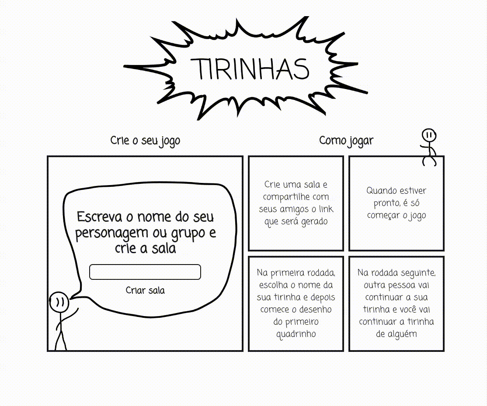

# Tirinhas

Tirinhas é um jogo estilo Gartic Phone para fazer tirinhas engraçadas com os seus amigos. Crie uma sala com o nome do seu personagem ou grupo que quer fazer uma tirinha sobre; depois convide os seus amigos e comecem a criar!



Demo do jogo na visão do host: [Clique aqui](https://www.youtube.com/watch?v=CN3a6A8nKws)

Demo do jogo na visão de convidado: [Clique aqui](https://www.youtube.com/watch?v=uv0kzKnoPLk)

## Fluxo de telas

O fluxo de telas do website foi feito no Figma e pode ser acessado clicando [aqui](https://www.figma.com/design/fEHA4NxIKo6PDqJfXrKM2r/Tirinhas?node-id=0-1&t=aF8ZUHzRiiPqiVbu-1)

## Como rodar localmente

Clone o repositório da forma que você preferir:

### HTTPS

```bash
git clone https://github.com/insper-tecnologias-web/projeto-3-equipe-legal-2.git
```

### SSH

```bash
git clone git@github.com:insper-tecnologias-web/projeto-3-equipe-legal-2.git
```

### GitHub CLI

```bash
gh repo clone insper-tecnologias-web/projeto-3-equipe-legal-2
```

Acesse o diretório do projeto:

```bash
cd projeto-3-equipe-legal-2
```

Instale as dependências:

```bash
npm install
```

Inicie o aplicativo:

```bash
npm start
```

O aplicativo estará disponível em `http://localhost:3000`.

## Como obter a imagem Docker

Para obter a imagem Docker do projeto, execute:

```bash
docker pull vitorkatakura/tirinhas:latest
```

[](https://classroom.github.com/a/jLW-plfN)
